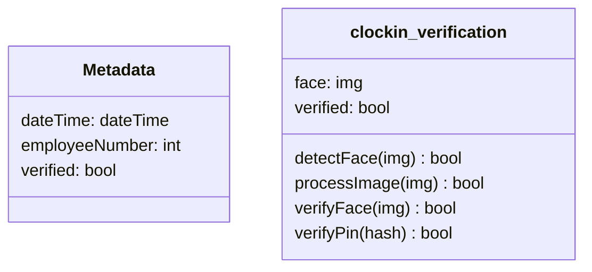
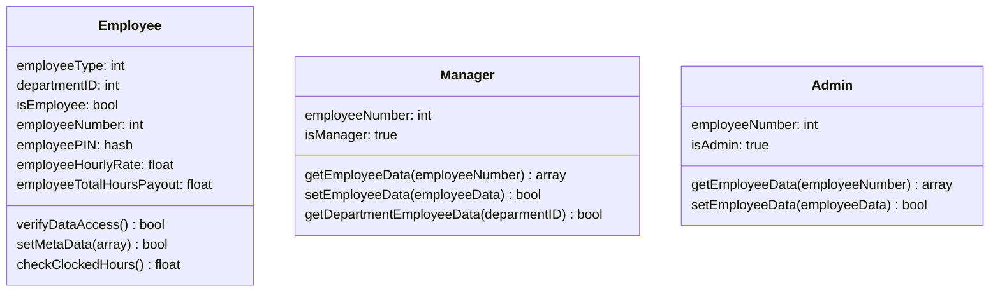
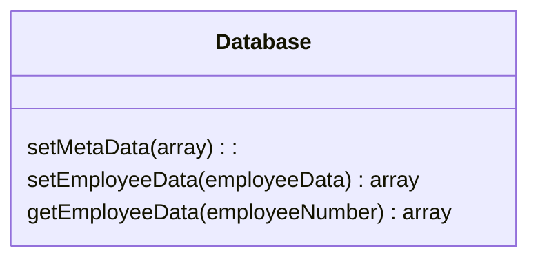

# Class Diagrams

## Client-side

```mermaid
classDiagram
    class Metadata{
        dateTime: dateTime
        employeeNumber: int
        verified: bool
    }

    class clockin_verification{
        face: img
        verified: bool

        detectFace(img) bool
        processImage(img) bool
        verifyFace(img) bool
        verifyPin(hash) bool
    }

```

## Server-side

```mermaid
classDiagram
    class Employee{
        employeeType: int
        departmentID: int
        isEmployee: bool
        employeeNumber: int
        employeePIN: hash
        employeeHourlyRate: float
        employeeTotalHoursPayout: float

        verifyDataAccess() bool
        setMetaData(array) bool
        checkClockedHours() float

    }

    class Manager{
        employeeNumber: int
        isManager: true

        getEmployeeData(employeeNumber) array
        setEmployeeData(employeeData) bool
        getDepartmentEmployeeData(deparmentID) bool
    }

    class Admin{
        employeeNumber: int
        isAdmin: true 

        getEmployeeData(employeeNumber) array
        setEmployeeData(employeeData) bool
    }

    
```

```mermaid 
classDiagram 
  class Database{
        setMetaData(array): 
        setEmployeeData(employeeData) array
        getEmployeeData(employeeNumber) array

    }
```